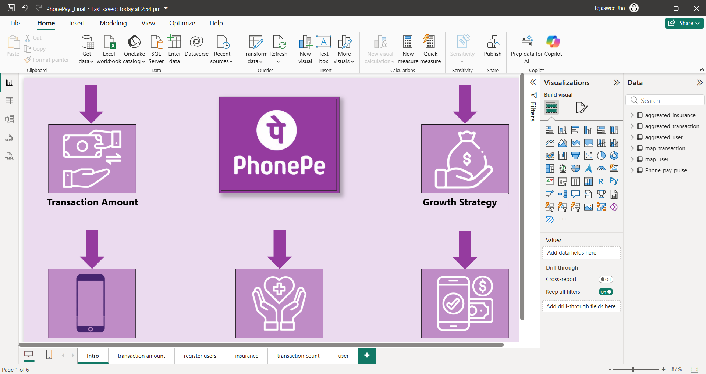
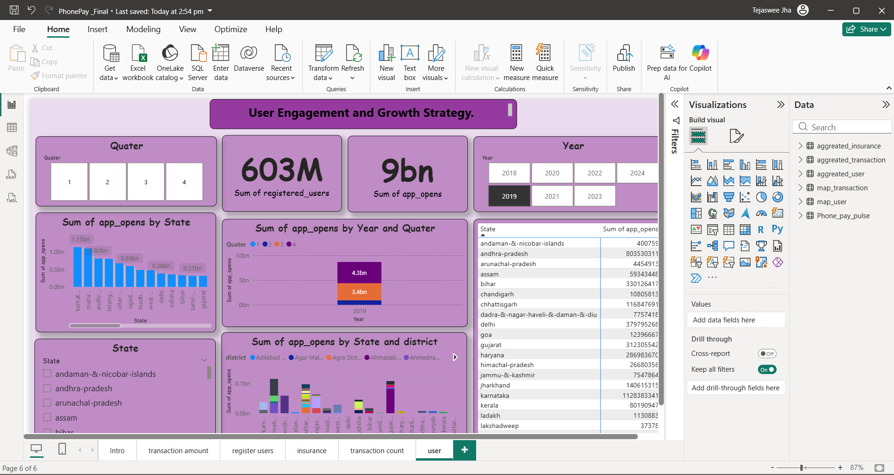

# PhonePe Transaction Data Analysis Dashboard

## Project Overview
This project is a Power BI dashboard that analyzes PhonePe transaction data. 
The dashboard provides insights into digital payment trends, transaction volume, 
and state-wise performance.

## Tools Used
- Power BI
- Excel Dataset
- Data Visualization

## Dashboard Insights
- Total transactions overview
- State-wise transaction analysis
- Quarterly payment trends
- Category-wise payment distribution

## Project File
PhonePay_Final.pbix contains the complete Power BI dashboard.

## Purpose
The goal of this project is to practice data analysis and visualization 
using Power BI and to generate insights from digital payment data.

## Dashboard Preview

